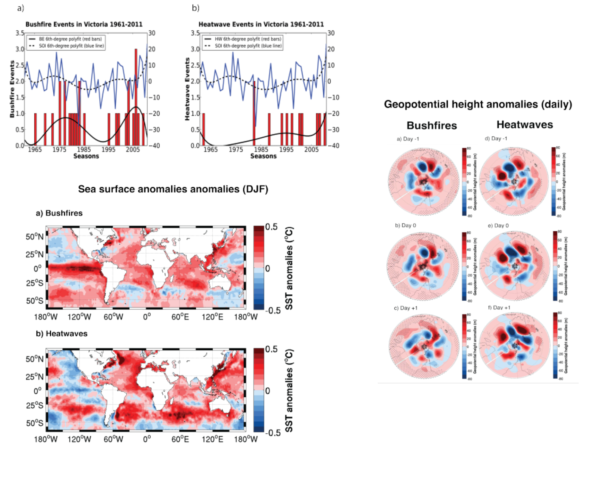

# Analyses from my PhD project "Fire weather in two regions of the Southern Hemisphere" 

This repository contains the Scripts used for my PhD thesis "Fire weather in two regions of the Southern Hemisphere" at the University of Melbourne.

The thesis (in English) can be accesed [at The University of Melbourne web page](https://minerva-access.unimelb.edu.au/handle/11343/191213)

From this thesis three papers (in Spanish) were published:

1. [Diferencias en el clima que produce incendios forestales y de olas de calor en Victoria Australia](http://200.12.169.32/index.php/RevFIG/article/view/1419)

2. [Desarrollo y evaluación preliminar de un índice climático simple para detección estacional de incendios forestales para Victoria, Australia](http://revistadigital.uce.edu.ec/index.php/RevFIG/issue/view/187)

3. [Peligro de incendios forestales asociado a factores climáticos en Ecuador](http://revistadigital.uce.edu.ec/index.php/RevFIG/issue/view/167)

## Table of Contents 

| Directory  | Contents  |
|---|---|
|  data_extraction |  Scripts used to extract and clean data from climatological annual reports (text files) from the Ecuadorian Meteorological Service (INAMHI)  |
| data_processing  | Data analysis included calculating complex drought and fire weather indices. The analyses used multidimensional gridded data in netCDF format, as well as tabular data |
|  donwloads | Most of the data came from reanalysis projects (20C and ERA) in netCDF format. These data had to be donwloaded directly from servers |
|  netcdf | Open source applications like CDO and NCO simplify common climate operations. Since these applications require netCDF file format exclusively, some text files were written as netCDF to use CDO and NCO |
| statistical_analyses  | The application of Python, Matlab and R statistical functions simplified most data analyses. Some additional scripts were developed.|
|  visualization |  The visualizations included time series, gridded composites, matrix correlations, probability density functions, etc.  |

## Data

 Most the data (for specific details please contact me) required to run the scripts can be found at:
 
 * [The Tweentieth Century Reanalysis Project](https://www.psl.noaa.gov/data/20thC_Rean/)
 * [ERA-20C reanalysis](https://www.ecmwf.int/en/forecasts/datasets/reanalysis-datasets/era-20c)
 * [INAMHI climate reports](http://www.serviciometeorologico.gob.ec/biblioteca/)
 * [Australian Bureau of Meteorology high quality datasets](http://www.bom.gov.au/climate/change/datasets/datasets.shtml)
 
## Computing environment

Running the scripts requires the following computing environment:

* Licensed MATLAB.
* Python 3 (Anaconda installation).
* Rstudio
* NCO and CDO

 
 
 
